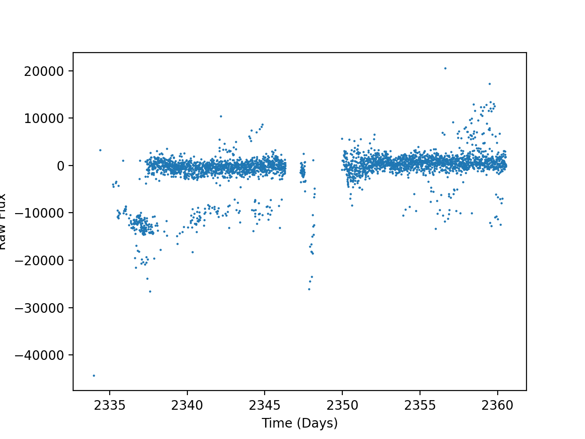

## Implementation of Sweepline Algorithms

A sweep line algorithm uses the concept of a line sweeping the Euclidean plane to solve problems. The most well known Sweep line ALgorithm is probably the [Fortue/Beachline Algorithm](https://en.wikipedia.org/wiki/Fortune%27s_algorithm) which is used to compute [Voronoi Diagrams](https://en.wikipedia.org/wiki/Voronoi_diagram)

The Beachline Algorithm is WIP. During my reasearch I needed to solve an anomaly removal problem for time series data where I needed to preserve the underlying graph while removing sets of datapoints that were not locally connected to the rest of the graph. Known methods were either insufficient or were too slow. For example, astropy's [sigma\_clip](https://docs.astropy.org/en/stable/api/astropy.stats.sigma_clip.html) would remove important outlier information and would not give the desired results on time series data such as these:

But with a sweepline approach, we can surgicaly remove outlying groups in fast time which would give us this result:

<img1 src="ex_post.png" width="100" height="100">
